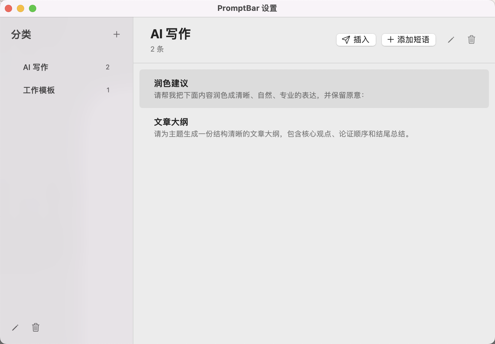

# 提示语快捷插入和管理【秘籍】

一款原生 macOS 应用，用来集中管理提示词，并通过快捷面板把常用内容一键插入到光标位置。

## 为什么需要它

在日常使用 AI、开发、客服和写作工具时，提示词往往散落在多个地方：

- 一部分存在备忘录，一部分存在 Notion、飞书或聊天记录
- 相同类型的提示词没有清晰分类，查找时需要反复搜索
- 想使用时，要先切换窗口、复制内容，再回到原来的应用粘贴
- 频繁切换会打断思路，也会丢失输入光标所在的上下文

**提示语快捷插入和管理【秘籍】**解决的就是这个问题：先把提示词集中到一个分类清晰的库中，需要时按 `⌘⇧Space` 呼出面板，选择后直接插入到光标所在位置，不用再离开当前工作场景。



## 核心能力

- 使用 `⌘⇧Space` 全局呼出快捷短语面板
- 支持鼠标单击、上下方向键选择，或按回车插入
- 支持搜索当前分类中的短语
- 分类和短语均支持新建、编辑、删除
- 设置窗口中双击短语可立即插入
- 也可以选中短语后点击“插入”
- 插入后自动恢复原剪贴板内容
- 本地保存到 `~/Library/Application Support/QuickInsert/shortcuts.json`

## 安装

构建后双击 `build/QuickInsert-1.0.0.dmg`，将应用拖到“应用程序”文件夹，然后打开应用。

应用会显示 Dock 图标，双击或再次启动时会自动打开设置窗口。菜单栏中也会创建“插”图标；如果菜单栏图标过多，macOS 可能暂时不显示它，此时仍可使用 Dock 图标或 `⌘⇧Space`。

如果 macOS 提示“无法验证开发者”，可在“系统设置 > 隐私与安全性”中点击“仍要打开”，或对 `.app` 执行：

```bash
xattr -dr com.apple.quarantine /Applications/QuickInsert.app
```

本机构建使用固定 `com.quickinsert.mac` 标识的临时签名。在辅助功能中完成一次授权后，正常更新不应再要求重新授权；如果手动重新打包时签名要求变化，仍需重新允许。

第一次插入时，需要在：

`系统设置 > 隐私与安全性 > 辅助功能`

中允许“提示语快捷插入和管理【秘籍】”。这是 macOS 用来向其他应用发送粘贴快捷键所必需的权限。

如果之前已允许过权限，但更新或重新安装后仍无法插入，请在辅助功能列表中先移除旧记录，再重新添加一次。

## 从源码安装

### 环境要求

- macOS 14.0 或更高版本
- Apple Silicon Mac
- Xcode Command Line Tools

如果尚未安装 Command Line Tools，可执行：

```bash
xcode-select --install
```

### 获取并构建

```bash
git clone https://github.com/nowensuzhou/prompt-quick-insert-manager.git
cd prompt-quick-insert-manager
./Scripts/build.sh
open build/QuickInsert-1.0.0.dmg
```

双击 DMG 后，将应用拖入“应用程序”文件夹，再打开应用。

构建脚本会使用 macOS Command Line Tools 自带的 Swift 编译器：

```bash
./Scripts/build.sh
```

产物位于 `build/`：

- `QuickInsert.app`
- `QuickInsert-1.0.0.dmg`
- `QuickInsert-1.0.0.pkg`
- `QuickInsert-1.0.0.zip`

构建使用本机临时签名，适合个人安装和测试；正式分发前需要使用 Apple Developer 证书签名并完成 notarization。

## 开源协议

本项目基于 [MIT License](LICENSE) 发布。
